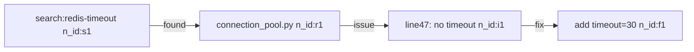

# Context Hygiene Research Survey (Sweeps 28–31)

Extracted from `hermes-context-hygiene/SKILL.md` so the skill body stays under the 600-line procedural budget.

Load this file when you need paper-level compression patterns, schema-bloat policy, or reversible-eviction designs. Do not load it by default on a hygiene checkpoint.

Index:
- Sweep 31 Additions
- Scroll — Context as Environment
- ContextPilot — Heterogeneous Context Actions
- Context Rot — Named Long-Run Failure Mode
- Control-Plane Tax + Tool-Result Caching
- Cache Drift Detection (Reasonix PrefixShape)
- If /compress is available / not invokable
- Mermaid Canvas Symbolic Memory (TencentDB)
- Agent-Controlled Compression / Focus Architecture
- Compact Constraint Headers 71% reduction
- ACON: Failure-Analysis-Driven Compression
- Tool Schema Lazy Loading
- MCP Server Onboarding: Schema & Response Bloat
- Sleeping Agent: Gist Compression
- NECROPHORESIS: Reversible Context Eviction
- OneDayAgent 3-Failure-Mode Taxonomy
- Content-Relevance Decay
- Typed Action Routing as Sole Self-Reflection
- Branch-and-Prune Context Surgery (Alyph)
- Self-GC: Mask + Prune Passes
- Verified Compaction
- Reasonix Three-Tier Compaction Cascade

---

## Sweep 31 Additions (Sep 2026)

### Cross-Session Context Locality Optimization (arXiv:2609.00148) ★ MED

Evidence from long-horizon deployments: agents retrieve and re-read context already in their
current working window. Re-buy rate: median 24% per session vs. ≤10% target. Root cause:
agents retrieve from long-term memory when a prior tool result already answered the question.

**Three-signal context locality rule:**
1. Before calling `hindsight_recall` or `session_search`: scan last 5 tool results for the answer first
2. Before calling `read_file` on a path already read this session: use cached content in context
3. Before making a second `web_extract` on the same URL: check if first extract covers the question

Re-buy rate estimate: (# retrieval calls) / (# questions with prior context in window). Target ≤10%.

**Also applies to:** `hermes-memory-surface-selection` (path-dependency check principle)

---

## Scroll — Context as Environment: Variable Binding vs Prompt Serialization (arXiv:2608.21690, Aug 2026) <!-- why: serializing tool outputs into the prompt grows context O(N); binding to variables keeps context O(1) per result -->

Scroll treats each agent session as an executable Session Environment:
- **Append-only Event Log** — lossless ground truth of all events; never compressed or lost
- **Persistent Python kernel** — maintains a typed namespace across model calls
- **Variable binding**: tool outputs are bound to named variables, not serialized into the prompt. Only explicitly printed projections enter the model's working view.

The insight: context management becomes a programming task (bind, search, transform) rather than a compression task (summarize, prune, truncate). Context pressure is avoided rather than managed.

**Hermes approximation (no Scroll runtime available):**

1. **Variable binding pattern for large tool results:** Instead of letting large web_extract or terminal outputs sit in context, immediately extract and bind the key values:
   ```python
   # Instead of: keeping full 5KB web_extract result in context
   # Do: extract what matters, discard the rest
   result = web_extract(urls=[...])
   papers_found = [r["title"] for r in result["results"]]  # bind to variable
   # Only papers_found enters subsequent reasoning; raw result can be pruned
   ```

2. **Eviction index with landmarks:** Before proactive pruning, record a compact eviction index: the session_message_id and a 1-sentence landmark description for each evicted block. This lets the agent navigate directly to evicted regions via `session_search(session_id, around_message_id=<id>)` rather than re-searching from scratch.

3. **Printed projection discipline:** When writing execute_code blocks, explicitly choose what to print (project) vs. compute silently. Only printed output enters the model context. Suppress intermediate calculation output; only print conclusions.

4. **Event Log approximation:** Use `hindsight_retain(content, context="event-log")` to write a durable log of major session events BEFORE they would be compacted away. This is the Event Log's role — lossless ground truth that survives context pressure.

Empirical: Scroll achieves 94.8% on LongMemEval-S, 73.1% on BEAM10M (+5.1 points over best published memory system), 86.7% on LOCA256K.

---

## ContextPilot — Heterogeneous Context Actions (arXiv:2608.28476) <!-- why: prune/summarize/bind are not interchangeable; trajectory-level success must not credit a mid-run prune -->

Proactive context editors that only search, delete, or summarize miss global planning
and adaptive compression. Context-management actions have unequal blast radius:
- **Bind / extract** (keep a named fact, drop the blob) — default, reversible
- **Prune completed-subtask tool output** — safe after the subtask is verified
- **Summarize the live plan** — high loss; do not do this to satisfy a token budget

Before any prune: name the surviving plan and acceptance criteria in one short block.
Prune only completed-subtask tool output. Never treat later session success as evidence
that a mid-run prune was safe — credit is not transferable across context-edit types.

Reference: arXiv:2608.21690, "Context as an Environment: Programmatic Context Management for Long-Horizon Agents", Aug 2026.

---

## Context Rot — The Named Long-Run Failure Mode (Qiita/JP, Aug 2026)
"Context Rot" (コンテキストの腐敗) is the failure mode where long-running agents begin violating architectural constraints because early instructions have been pushed out of the active context window. Tool results (grep, read_file) return truncated output due to token budget caps; after dozens of iteration cycles the original system-level constraints are gone. The agent makes locally-correct but globally-inconsistent fixes with no visible error — it does not know it is violating them.

Mitigations:
- **ContextPacker pattern**: pre-bundle all files relevant to a feature area into a single delimiter-separated text chunk committed as `file_concatenator_settings.json` per feature area; inject the whole bundle at session start rather than relying on the agent to discover files dynamically mid-run.
- **Constraint pinning**: write any constraint that must hold across the entire task into a file re-read at each major phase boundary — not just injected once as a system prompt fragment.
- **Phase boundary re-injection**: at each delegate_task call boundary, include top-level task constraints explicitly in the `context` parameter, not just in the parent system prompt.

Reference: Qiita/futayubi5656 "LLM ContextPacker", Aug 19 2026.

---

## Control-Plane Tax + Tool-Result Caching (arXiv:2608.15127, Aug 2026)

Characterization of 10 real agentic workloads: non-LLM components (tool execution, sandbox setup, auxiliary LLM calls, tool schema overhead) dominate latency in 5/10 apps. Two directly actionable findings:

- **Tool-result caching eliminates 35.2% of redundant calls** — agents re-call identical tools (same args, same context) because they don't track whether they already have the answer. Before calling a tool, check whether session_search or Hindsight already has the answer from this session.
- **Task-aware model routing cuts latency 29–40%** — use a lighter/faster model for low-complexity steps. Maps to `claude-routing-hierarchy`: don't use sonnet-4-6 for every step; use haiku-class for classification/routing sub-steps inside a larger task.
- **Control-plane tax**: auxiliary LLM calls for routing, tool-schema loading, and context injection crowd out productive context. Minimize tool schema exposure via `enabled_toolsets` in delegate_task calls; avoid re-loading known skill bodies mid-task.

Reference: arXiv:2608.15127 "From LLM Inference to Agentic Workloads: AgentSysBench."

---

---

## Cache Drift Detection (Reasonix PrefixShape pattern, 2026)

A cache miss mid-session that surprises you is almost always one of three causes.
Track them explicitly:

| Drift source | What changed | How to detect |
|---|---|---|
| System prompt mutation | A skill, memory block, or dynamic value was inserted into the stable prefix mid-session | Compare system prompt hash before/after each turn that adds context |
| Tool schema change | A new tool was registered or a description changed between turns | Tool definitions must be sorted and stable; registration order must not matter |
| Log rewrite / version bump | An internal field (e.g. session ID, turn counter) was embedded in the cached block | Never embed mutable state in the prefix; move it to the user-message tail |

**Practical rule for Hermes:** once a session starts, treat the system prompt as
read-only. Any context that varies per-turn (task state, tool results, per-turn
memory) goes in the **user message prefix**, not in the system prompt.

**Tool schema sort invariant:** when multiple tools are active, their combined schema
block must have a deterministic order (sort by name). If tool registration order
differs between sessions (e.g. lazy loading, async registration), the cache key
shifts even when the tool set is identical. In Hermes, tool order is set by the
harness — but if you're building dynamic toolsets (e.g. MCP server subsets), always
sort the final list before including it in a context packet.

**Prior summaries are never re-summarized** (Reasonix `summaryTagOpen` invariant):
When Hermes produces a `[CONTEXT COMPACTION — REFERENCE ONLY]` block, that block is
already a digest — never include it in the next fold's input. Folding a summary
produces lossy double-compression and introduces hallucinated "confirmations" of
prior summaries' claims. The compaction algorithm must pin prior summary messages
verbatim and exclude them from the foldable region.

**Token estimation — use actual usage data:**
The standard heuristic of ~4 chars/token is a rough approximation. Actual token-per-char
ratios vary by language, model, and content type (code vs prose vs tool JSON). When
accurate threshold tracking matters, read the `usage` field from the provider response:
`cache_read_input_tokens + cache_creation_input_tokens + input_tokens`
and derive your own `tokPerChar = total_tokens / total_chars_sent` from recent turns.
This self-calibrates to the actual provider tokenizer rather than a fixed guess.

---

## If `/compress` is available
- use `/compress` at those trigger points instead of waiting for the session to degrade further

## If `/compress` is not invokable from the current tool surface
- say that briefly and plainly
- recommend `/compress` explicitly at the trigger point
- then continue with the lowest-context execution path available
- do not produce a long explanation about why compression cannot be invoked
- if the user explicitly says some version of "compress context", treat that as a request for immediate action: give the direct `/compress` instruction first, keep the explanation to one or two lines, and do not bury the answer under caveats

---

## Mermaid Canvas Symbolic Memory (TencentDB Agent Memory, 2026)

A complementary approach to context hygiene for long agentic tasks with heavy tool output:

**Pattern:** Instead of compressing or discarding tool output, **offload it** and replace it with a
compact Mermaid graph in active context. The graph encodes task state transitions using `node_id`
labels; the full raw output lives in external `refs/*.md` files. Agent reasons over the graph;
greps `node_id` to retrieve raw detail on demand.



**Token impact claimed:** -61% on WideSearch, -33% on SWE-bench.

**How to apply manually (no plugin required):**
1. After a batch of large tool outputs, write the key state transitions as a Mermaid diagram to `/tmp/session-canvas.md`
2. Archive the raw output to `/tmp/refs/<node_id>.md`
3. Keep only the canvas in active context; read-file the refs only when a node_id needs detail
4. Reference: `tencentdb-agent-memory` skill for plugin installation and full workflow

**When it beats /compress:** when you need full traceability back to raw evidence; /compress is
irreversible. Canvas offloading is lossless — every raw log is one `node_id` grep away.

---

## Agent-Controlled Compression (Focus Architecture — arXiv:2601.07190)

For long agentic tasks where `/compress` is not available or too coarse, the **Focus Agent** pattern offers in-loop control:

- Add two agent tools: `start_focus` (marks a checkpoint) and `complete_focus` (summarizes + prunes)
- Agent summarizes: "what was attempted, what was learned, what is the outcome" → appended to a persistent Knowledge block at context top → raw logs deleted
- Creates a "sawtooth" context pattern: grows during exploration, collapses at consolidation
- **22.7% token reduction** on SWE-bench (14.9M → 11.5M tokens) with no accuracy loss (Claude Haiku 4.5, N=5 hard instances)
- **Critical:** Passive prompting yields only 6% savings. Aggressive prompting is required: explicit instructions to compress every 10–15 tool calls + periodic system reminder injection
- Best suited for "explore → implement" tasks; overhead exceeds benefit on purely iterative refinement tasks
- **System prompt + YAML template**: `python3 ~/.hermes/scripts/focus_compress.py --mode guide` for full implementation guide, `--mode system` for system prompt snippet, `--mode summary` for summarization prompt
- Full reference: `references/multilingual-agent-papers-fr-ru-uk-2024.md` in the `academic-literature-review` skill

---

## Compact Constraint Headers — 71% Token Reduction (arXiv:2604.07192)

Research: "Compact Constraint Encoding for LLM Code Generation" (Tang, Apr 2026)
11 models, 830+ invocations, 16 benchmark tasks.

Key finding: structured compact constraint headers save **71% of constraint-section tokens** and
**25–30% of full-prompt tokens** with negligible effect on Constraint Satisfaction Rate (Cliff's δ < 0.01).

### What this means for Hermes

- The FORMAT of constraint encoding barely matters for compliance
- The DESIGN of constraints (what you ask for) matters enormously — 9pp gap between
  normal vs. counter-intuitive constraints, regardless of format
- Use structured headers freely (they're free wins for token efficiency)
- Spend engineering effort on *what* you constrain, not *how* you format it

### Compact header pattern

```
# CONSTRAINTS [compact]
format: json | no_extra_keys | max_depth: 3
scope: python_only | stdlib_ok | no_subprocess
output: single_function | max_lines: 50
must_handle: ValueError, FileNotFoundError
```

vs. verbose NL (unnecessary):
```
Please ensure that the output is a valid JSON object without any additional keys
beyond what was specified. The code should only use Python standard library...
```

Both achieve similar compliance. The compact version saves 60-70% of constraint tokens.

---

## ACON: Failure-Analysis-Driven Compression (arXiv:2510.00615, ICML 2026, Microsoft Research)

When compression is failing — task errors after summarization, agent losing track of a
constraint, or repeated context-bloat in similar tasks — the issue may not be *that* you
compress, but *how* you compress. ACON makes the compression policy self-improving:

1. Identify the failure: did the summary drop a critical constraint? Did a key entity
   name get collapsed? Did the agent lose a decision that was made 3 steps ago?
2. Write a one-sentence guideline update:
   "When compressing <task type>, always preserve <critical element> and discard <noise pattern>."
3. Store as a Graphiti fact: `mcp_graphiti_add_triplet("compression-guidelines", "APPLIES_TO",
   "<guideline text>", "<task type>", group_id="hermes-reasoning")`
4. On the next similar task, retrieve before compressing:
   `mcp_graphiti_search_memory_facts("compression guidelines <task type>", group_ids=["hermes-reasoning"])`

Result: 26-54% token reduction reported on AppWorld/OfficeBench. Applies across sessions —
guidelines accumulate over time and improve future compression automatically.

---

## Tool Schema Lazy Loading — 95% Per-Turn Reduction (2604.21816, 2606.17016, Aug 2026)

Two complementary patterns for the biggest single-surface token win in agentic workflows:

### Tool Attention / Intent-Gated Schema Loading (arXiv:2604.21816)
Keep compact tool summaries (~50 tokens each) in context; promote full JSON schema only
for the top-k tools relevant to the current intent. Benchmark: 47k → 2.4k tokens/turn
(95% reduction) on a 120-tool suite, context utilisation 24% → 91%.

Hermes approximation (no middleware available):
- When running tasks with large toolsets (>20 active tools), mentally gate which tool
  families are actually needed for the current subtask and use `enabled_toolsets` on
  cron/delegate calls to keep the active surface small.
- For MCP tools: use `hermes mcp configure` to disable tool categories not needed for
  a task class before starting a long session.
- Priority order: narrow `enabled_toolsets` first > MCP tool disable > description trim.

### TokenPilot: Cache-Stable Context Eviction (arXiv:2606.17016, Zhejiang U)
Ingestion-Aware Compaction: stabilise prompt prefixes *at ingestion time* to prevent
cache invalidation. Lifecycle-Aware Eviction: only evict context when task relevance
expires — not on arbitrary LRU. Benchmark: 61–87% cost reduction vs prior pruning methods.

Key insight for Hermes: the existing "static prefix" cache rule is correct but incomplete.
Context eviction should track *task relevance* not just age:
- Tool outputs from completed subtasks: evict freely (task-relevance expired)
- Tool outputs from in-progress subtasks: never evict (still referenced)
- Skill content injected mid-session: evict after the task it was loaded for completes

### Control Under Compression Safety Cliff (arXiv:2608.01056)
Reliability cliff at ~35% retention: below that threshold, tool-using agents fail
catastrophically regardless of compression method. Section-based compression (preserve
entire logical sections rather than token-sampling uniformly) is the safest approach.

**Hard rule for Hermes**: when manually compacting tool output, never reduce any single
coherent section below 35% of its original length. Better to drop an entire old section
than to compress all sections uniformly past the cliff. Snip → full-section-drop, not
snippet-everything.

---

## MCP Server Onboarding: Schema & Response Bloat (2026-07 research pass)

Tool-definition schemas and raw tool-call responses are a second, distinct token-bloat
surface from conversation/session context above. Apply this policy whenever adding,
auditing, or evaluating an MCP server.

**Local static linter — `lintlang`** (`~/.hermes/integrations.disabled/lintlang`, disabled
by default, offline/deterministic, zero LLM cost):
- Scope it to actual tool/agent config files (JSON/YAML tool definitions), not prose
  SKILL.md docs — it is a schema linter (H1–H7 checks: verbosity, duplicate descriptions,
  missing examples, oversized enums, etc.), not a markdown-quality tool. Running it against
  ~140 SKILL.md files produces near-100% false-positive REVIEW/FAIL noise (prose safety
  sections read as "missing" because they're not machine-parseable schema fields).
- Rebuild venv before use if it's been dormant: `cd ~/.hermes/integrations.disabled/lintlang
  && rm -rf .venv && python3 -m venv .venv && .venv/bin/pip install -q -e .`
- Run: `.venv/bin/lintlang scan <path-to-tool-defs> --format json --fail-on fail`
- Verified 2026-07-06: local MCP config surface (config.yaml servers block, plugin YAMLs)
  scans clean — no oversized/verbose tool schemas. Re-check after any MCP enable/disable.

**MCP-server-onboarding compression policy** (mcp-compressor / dynamic-toolset pattern,
Atlassian + Speakeasy research, up to 97% schema-token reduction on 90+ tool servers):
- Threshold: only relevant once a single server's tool count exceeds ~15-20 tools, or
  combined active toolset exceeds ~40-50 tools. Below that, compression proxies add
  complexity (2-3x more round trips) for no measurable benefit.
- Current inventory (live `config.yaml` MCP `enabled` flags): `qmd` **disabled**,
  `mempalace` **disabled** (Iris Xe VRAM), `graphiti` **enabled** (**17 tools** —
  add_memory, add_triplet, build_communities, clear_graph, delete_entity_edge,
  delete_episode, get_entity_edge, get_episode_entities, get_episodes, get_prompt,
  get_status, list_prompts, list_resources, read_resource, search_memory_facts,
  search_nodes, summarize_saga — sits *inside* the 15-20 borderline range),
  `stealth-browser-mcp` **enabled** (deferred catalog; do not count as always-injected
  schema). Graphiti is borderline: do not claim "none cross the threshold". No
  action forced yet (below the 40-50 combined *injected* toolset trigger and below
  the hard >20 single-server trigger), but re-check if graphiti adds tools; that
  would warrant description trimming or selective disable via `hermes mcp configure`.
- Policy for future onboarding: before enabling any new third-party MCP server, count
  its exposed tools. If >15-20, front it with a compression layer (trim descriptions,
  drop rarely-used tools, or a proxy like mcp-compressor) before enabling by default —
  don't onboard raw and fix later.

**`defer_loading` / Anthropic Tool Search Tool** (beta header `advanced-tool-use-2025-11-20`,
85% reduction + accuracy gain in Anthropic's own benchmarks):
- Not currently exposed at the Hermes CLI/harness level — `hermes tools`/`hermes mcp`
  have no `--defer` or lazy-load flag, and config.yaml has no `defer_loading` key.
  Feasibility check result: **not actionable today without upstream Hermes harness
  support**; revisit if/when Hermes exposes an Anthropic beta-header passthrough or its
  own lazy-tool-loading mechanism.
- Until then, the practical substitute is the compression-threshold policy above
  (keep active toolset small) plus per-task toolset scoping (`-t TOOLSETS`,
  `enabled_toolsets` on cron jobs) rather than always loading the full default surface.

---

## Sleeping Agent: Gist Compression Silently Drops Temporal Information (arXiv:2608.11775)

Empirical finding: gist-based compression (summarizing older conversation) consistently fails on
temporal questions — dates and times are discarded because gist prompts preserve relational
structure but not temporal expressions. The failure is silent: the agent appears to answer
correctly but reasons from incorrect temporal context.

Results: Salience-Weighted Consolidation (SWC) diagnostic; +0.314 judge accuracy recovered on
temporal questions with a single-sentence prompt fix. 20x increase in temporal preservation.

**Immediate workaround (no code change required):**
When writing or invoking a compaction/gist prompt, append:
"Preserve ALL explicit dates, times, durations, deadlines, and temporal references verbatim —
do not paraphrase or omit any temporal expression."

**Salience tiering for Hermes compaction:**
- **High salience** (never discard): task spec, key decisions, error messages, temporal expressions
  (dates/times/deadlines), credentials or paths referenced by later steps
- **Mid salience** (summarize): intermediate reasoning, search result summaries
- **Low salience** (discard first): raw tool output already acted on, repeated tool schemas,
  verbose success messages

Apply the temporal-preservation instruction whenever you write a manual compaction or summary
that will be carried into a subsequent session.

---

## NECROPHORESIS: Reversible Context Eviction (Blast Radius, arXiv:2608.07440, Aug 2026)

Standard compaction is lossy — summaries discard information. Blast Radius proposes
**NECROPHORESIS**: archive evicted context verbatim (not summarized) and enable byte-exact
resurrection if later turns need it.

Key finding: 17–26% token reduction across 7 OpenAI models, zero false resurrections
(of 450 buried segments, 378 were **Recurring Dead Matter**, 0 were incorrectly recalled).

**Recurring Dead Matter (RDM):** Context segments that appear repeatedly across turns —
boilerplate headers, repeated tool schemas, stock error messages, identical system-prompt
fragments injected multiple times. Identifying and tombstoning RDM is the highest-ROI
eviction pass.

**Hermes approximation (no runtime modification needed):**
1. Before any manual compaction pass, scan the conversation for RDM:
   - Tool schemas or descriptions repeated 3+ times verbatim
   - Boilerplate error/success messages with identical text across multiple tool calls
   - System-prompt fragments that appear in both the system prompt AND as quoted text in tool results
2. In `session_search`, look for messages with identical or near-identical bodies — these are RDM
3. Tombstone RDM first (replace with 1-line stub + pointer to archived copy) before touching
   non-repeated content
4. Archive dropped content to `/tmp/session-evicted-<timestamp>.md` for potential resurrection
   rather than discarding

**Lossless eviction principle:** prefer dropping an entire stale section (full-section-drop) over
compressing all sections uniformly past the 35% safety cliff (per existing Control Under
Compression rule above). NECROPHORESIS is the lossless version of section-drop: archive before
dropping, resurrect if needed.

---

## OneDayAgent 3-Failure-Mode Taxonomy (arXiv:2608.05013, Aug 2026)

Long-horizon agentic tasks fail via exactly three simultaneous failure modes:
1. **Goal drift** — agent's subgoal diverges from original task as context grows
2. **State loss** — key intermediate results or decisions are overwritten or forgotten
3. **Context overflow** — window fills, compression drops critical state

**These compound.** State loss causes goal drift; goal drift causes decisions not worth preserving
(wasted context); context overflow accelerates both.

**OneDayAgent mitigation pattern (SOTA: 0.821 on AgentIF-OneDay, 104 tasks):**
- Decompose request → bounded subtasks with explicit completion criteria (prevents goal drift)
- Execution memory under compression pressure: always preserve the subtask completion checklist,
  not the raw tool outputs (prevents state loss during compaction)
- Final verification + repair loop: after all subtasks complete, run a structured comparison
  against the original request (catches goal drift that accumulated silently)

**Hermes encoding of this taxonomy:**

| Failure mode | Detection signal | Mitigation |
|---|---|---|
| Goal drift | Subtask outputs don't directly contribute to the original request | Re-read original task spec before each new subtask |
| State loss | A decision made 5+ turns ago can't be reconstructed from context | Write key decisions to scratch file / Graphiti immediately |
| Context overflow | Token usage > 60% of window before work is done | Apply snip tier; branch-and-prune failed attempts |

Apply this taxonomy when diagnosing why a long agentic run went off the rails — label the
failure before fixing it, because each failure mode has a different fix.

---

## Content-Relevance Decay — Compression Trigger Correction (arXiv:2604.17091) <!-- rationale: irrelevant content actively degrades reasoning, not just wastes tokens; applies to manual compression decisions -->

The arXiv finding is from RAG-style context injection studies: irrelevant content ACTIVELY
degrades reasoning (not just wastes tokens). Three failure modes independent of context budget:
1. **Positional bias** — mid-context evidence is buried
2. **Irrelevant content actively degrades** — the finding is that injection of irrelevant content
   is worse than absent context, not merely wasteful
3. **Effective hallucination-free context is ~10x shorter than nominal window**

Note: Hermes `micro_compact=true` (every 3 turns, configured in runtime) is a separate mechanism
from the agent's manual compression decisions. The arXiv finding applies to the AGENT's judgement
about WHEN to manually compress or evict — not to the runtime's micro_compact feature.

**Manual compression trigger adjustment:**
- Do not trigger manual compression purely on turn count
- Trigger when retrieved content becomes semantically distant from current subtask
  (topic shift detected — practical proxy: you are now working on a subtask whose inputs
  don't reference anything from the previous subtask's tool outputs)
- After a subtask completes: evict that subtask's tool outputs (task-relevance expired)
- Before a NEW subtask begins: check if prior subtask's context is still relevant; if not, snip

This aligns with TokenPilot's Lifecycle-Aware Eviction: evict when task relevance expires.

---

## Typed Action Routing as the Sole Self-Reflection Mechanism (arXiv:2608.12322, Sweep 15) ★ MED

Controlled six-condition ablation isolating four self-reflection components. Key null results:

1. **Taxonomy vocabulary adds nothing** — presenting the full uncertainty taxonomy while
   collapsing to a single generic action yields ΔF1 = +0.008 (CI overlapping zero).
   Vocabulary labels are decorative; routing is the mechanism. <!-- why: prevents over-engineering reflection prompts with elaborate taxonomies -->

2. **Structured diagnostic questions add no value** over unstructured reflection
   (F1 = 0.296 vs 0.297, p = 1.000). Scaffolding is not the mechanism.

3. **Typed action routing is the only mechanism that actually works.** The gain
   from self-reflection comes entirely from having distinct action types (e.g.
   "gather more evidence", "escalate", "commit answer") — not from diagnostic
   vocabulary, not from structured questioning.

**Hermes context hygiene implications:**

- When writing self-reflection prompts or correction loops in skills or agent loops,
  use **sparse typed action routing** rather than elaborate taxonomies:
  ```
  REFLECTION ACTIONS (choose one):
  A: GATHER — evidence gap; issue one targeted search
  B: ESCALATE — uncertainty too high; surface to human
  C: COMMIT — sufficient confidence; proceed
  ```
  Three typed actions is sufficient. More types add no value; fewer collapses to no routing.

- The existing ACON pattern (failure → guideline update) implicitly uses typed routing
  (compress / evict / discard). This is correct — keep it typed and sparse.

- **Remove any elaborate "uncertainty taxonomy" from context-hygiene prompts** added to
  system context or skill bodies. The taxonomy vocabulary itself is zero-value overhead.

---

## Branch-and-Prune Context Surgery (Alyph, HN Aug 7 2026)

Standard context compression collapses uniformly. Branch-and-prune is selective: it identifies
**"attempt → failure → correction" triplets** in context and collapses them to just the
resolution, discarding the failed attempt and the correction step entirely.

Pattern to apply during manual context hygiene:
1. Scan prior turns for: tool call that failed, retry with correction, final success
2. Collapse all three turns to: a single note "tried X, failed because Y, used Z instead"
3. Preserve the resolution; drop the failure chain

This yields disproportionate context savings in debugging/iteration sessions where failed
attempts dominate the context. In a 10-attempt debugging sequence, 9 failed attempts may
occupy 80%+ of context but carry zero forward-useful information.

**Hermes implementation:** When a session has >5 sequential tool calls addressing the same
goal and most are retries/failures, apply branch-and-prune before the next delegation or
before context hits the proactive_prune threshold. Use `session_search` to identify the
resolution, write a summary to assistant prose, then rely on compression to drop the chain.

---

## Self-GC: Mask + Prune Passes (Spike-J validated, ~12% savings)

Two compaction passes for identifying candidate segments to review before compression.
Validated on real Hermes session data (196 sessions, 61k messages; one tested session:
mask=53 segments, prune=4, ~12% char reduction). Results are CANDIDATES for review,
not segments to auto-delete.

**Scope:** intermediate tool result turns only (not user turns, not the most recent turn,
not turns containing unique identifiers like file paths, UUIDs, or API response IDs).

### PRUNE pass - identify orphaned segments
A segment is a prune CANDIDATE if NO 10-char substring appears in any later turn.
Orphaned content: nothing downstream referenced it. Review before deleting.

```python
def find_prune_candidates(turns: list) -> list:
    """
    Return indices of turns (excluding last) where no 10-char ngram appears in later turns.
    Exclude last turn (empty later string makes everything look orphaned).
    Results are candidates - review before deleting.
    """
    if len(turns) <= 1:
        return []
    candidates = []
    for i in range(len(turns) - 1):  # exclude last turn
        turn = turns[i]
        if len(turn) < 10:
            continue
        ngrams = {turn[j:j+10] for j in range(len(turn) - 9)}
        later = ' '.join(turns[i+1:])
        if ngrams and not any(ng in later for ng in ngrams):
            candidates.append(i)
    return candidates
```

### MASK pass - identify fully-restated segments
A segment is a mask CANDIDATE if >=80% of its 10-char substrings appear verbatim in later turns.
JSON results with unique IDs/paths will naturally have low overlap and won't be flagged - correct.

```python
def find_mask_candidates(turns: list, threshold: float = 0.8) -> list:
    """
    Return indices of turns (excluding last) where >=threshold of 10-char ngrams appear in later.
    Results are candidates - review before collapsing to stub.
    """
    if len(turns) <= 1:
        return []
    maskable = []
    for i in range(len(turns) - 1):  # exclude last turn
        turn = turns[i]
        ngrams = [turn[j:j+10] for j in range(len(turn) - 9)]
        if len(ngrams) < 10:
            continue
        later = ' '.join(turns[i+1:])
        hit_rate = sum(1 for ng in ngrams if ng in later) / len(ngrams)
        if hit_rate >= threshold:
            maskable.append(i)
    return maskable
```

### FOLD pass (deferred)
Deferred until tool-call arg normalization is reliable (whitespace/key-order variance
causes false negatives). Do not apply blindly.

### When to run
- Before any /compress or manual compaction event
- After receiving a large delegation batch (>5K chars)
- When session hits 60% context fill
- Always review candidates before deleting - do not auto-prune

<!-- why: orphaned and fully-restated intermediate tool results waste tokens; ~12% char reduction measured on one real session (Spike-J, Sep 2026); savings vary by content -->

---

## Verified Compaction (arXiv:2607.21503 Agentic Context Management)

Compaction is not safe by default. Three modes and their costs:
  naive accumulation : quadratic token cost, full fidelity — never scale
  crude summarization : linear cost + accuracy cliff (key facts disappear)
  validated compaction: linear cost + fidelity — requires recoverability test

Rule: after ANY compression event, run a spot-check before the next tool call:
  1. Pick 2–3 facts that were active immediately before compression
     (e.g. a filename written, a config value changed, a paper ID cited)
  2. Ask: “are these recoverable from the compressed context?”
  3. If NOT recoverable: initiate new-session handoff immediately; do NOT continue
     in the current session as if context is intact
  4. Log the compression event + recoverability result in a hindsight_retain call
     so cross-session fidelity is tracked

This is especially critical after the haiku compression fallback fires on long cron
agent runs — S4 (compression stall) and context rot (S2) can compound silently.

---

## Reasonix Three-Tier Compaction Cascade

Hermes triggers full compaction at a single threshold. Reasonix's three-tier cascade
avoids expensive summarizer calls when cheaper options suffice:

| Tier | Token fill | Action | Cost |
|---|---|---|---|
| Soft (50%) | Context growing | Report only; preserve prefix | Free |
| **Snip (60%)** | **Stale tool output piling up** | **Rewrite only old tool results in-place (no summarizer call)** | Cheap |
| Hard (80%) | Near-limit | Full compaction: prune → snip → fold → emergency mechanical fold | Expensive |

**The snip tier is the key insight:** between 60–80% fill, full compaction is wasteful.
Instead, rewrite only the stale (old, no-longer-referenced) tool results — replace their
full content with a one-line summary or stub — without touching assistant text or user turns.
This keeps the history navigable and defers the expensive summarizer call.

**Compaction invariants (Reasonix — apply these in Hermes when compacting manually):**
- User turns are **never** summarized away — only assistant/tool content folds
- Prior summaries accumulate; never re-summarize a block that is already a summary
- First user turn is pinned verbatim (their stated facts/constraints)
- Error messages and user-marked content (`[[keep]]` prefix) retained across folds
- Dropped messages should be archived to a timestamped file (full traceability)
