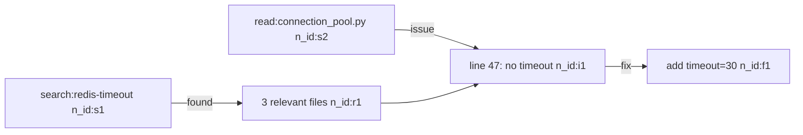

# TencentDB Agent Memory

**Repo:** https://github.com/TencentCloud/TencentDB-Agent-Memory  
**npm:** `@tencentdb-agent-memory/memory-tencentdb`  
**Install path (this machine):** `~/.memory-tencentdb/tdai-memory-openclaw-plugin/`  
**Hermes plugin symlink:** `~/.hermes/hermes-agent/plugins/memory/memory_tencentdb`

## What It Does

Two complementary systems:

### 1. Layered Long-Term Memory (L0→L3 Pyramid)
- **L0:** Raw conversation (SQLite + JSONL)
- **L1:** Atomic facts extracted every N turns (LLM extraction + vector dedup)
- **L2:** Scenario/scene blocks aggregated from L1 (Markdown files)
- **L3:** Persona — user profile distilled from L2 (`persona.md`)
- **Retrieval:** starts at L3 persona, drills down to L0 only when needed (progressive disclosure)
- **Key difference from Hindsight/Graphiti:** structured 4-tier hierarchy vs flat graph; LLM-extracted atomic facts vs raw embeddings; human-readable Markdown at upper tiers

### 2. Symbolic Short-Term Memory (Mermaid Canvas)
- Verbose tool outputs → offloaded to `refs/*.md` external files
- A compact Mermaid graph (few hundred tokens) replaces the raw output in context
- Agent reasons over the graph; fetches full raw content via `node_id` on demand
- **Claims:** -61% tokens on WideSearch, -33% on SWE-bench, PersonaMem 48%→76%

### 3. Storage & Retrieval
- **Local-first:** SQLite + sqlite-vec, zero external dependencies
- **Hybrid retrieval:** BM25 (keyword) + vector (semantic) + RRF fusion
- **White-box:** L2 scenarios and L3 persona live as readable Markdown files at `~/.memory-tencentdb/memory-tdai/`
- **Debuggable drill-down chain:** Persona → Scenario → Atom → Conversation (no opaque vector black box)

## Assessment vs Hermes Existing Memory

| Capability | Hermes (existing) | TencentDB |
|:-----------|:-------------------|:----------|
| Long-term memory | Hindsight (cloud, text-embedding-3-small 1536d), Graphiti (graph, group_id=hermes) | L0-L3 pyramid, atomic facts, structured persona |
| Short-term context compression | hermes-context-hygiene (manual), Focus Agent pattern | Mermaid canvas offload (automated, per-task) |
| Retrieval | Graphiti hybrid (QMD disabled — use session_search fallback) | BM25+vec+RRF fusion, progressive L3→L0 |
| White-box debug | session_search (QMD disabled), Graphiti | persona.md, scenario blocks, result_ref traces |
| Cross-session search | session_search (FTS5 SQLite) | L1 episodic search, L0 conversation search |

**Verdict:** Complementary, not redundant. TencentDB's main unique values:
1. **Structured persona distillation** — Hindsight/Graphiti don't build a progressive L3 user persona from L2 scenes
2. **Automated Mermaid canvas offloading** — Hermes has no automated short-term context offload; the context-hygiene skill is manual discipline
3. **Atomic fact extraction** — LLM-driven L1 extraction is more structured than raw embeddings
4. **White-box Markdown artifacts** — human-inspectable even without a query interface

## Installation (this machine — already installed 2026-07-09)

### Status
- ✅ Package at `~/.memory-tencentdb/tdai-memory-openclaw-plugin/` (v1.0.0)
- ✅ Symlink: `~/.hermes/hermes-agent/plugins/memory/memory_tencentdb`
- ✅ Plugin discovered: `hermes memory status` shows `memory_tencentdb (API key / local)`
- ⏳ Active provider: **still `hindsight`** (intentionally unchanged)
- ⏳ Env vars in `~/.hermes/.env`: need manual addition (write was gated)

### Manual Steps to Activate

#### Step 1 — Add env vars to `~/.hermes/.env`
```bash
MEMORY_TENCENTDB_GATEWAY_HOST=127.0.0.1
MEMORY_TENCENTDB_GATEWAY_PORT=8420
MEMORY_TENCENTDB_LLM_BASE_URL=https://api.anthropic.com/v1
MEMORY_TENCENTDB_LLM_MODEL=claude-haiku-3-5
MEMORY_TENCENTDB_LLM_API_KEY=<same value as ANTHROPIC_API_KEY>
```

#### Step 2 — (Optional) Change active provider
```yaml
# ~/.hermes/config.yaml
memory:
  provider: memory_tencentdb
  # Do NOT set this until env vars are confirmed
```

#### Step 3 — Verify gateway
```bash
# After starting Hermes with memory_tencentdb provider, gateway auto-starts
curl http://127.0.0.1:8420/health
# Expected: {"status":"ok"} or {"status":"degraded"}
```

#### Step 4 — Tune for English
Default BM25 tokenizer is Chinese (jieba). For English primary:
```json
// ~/.memory-tencentdb/memory-tdai/tdai-gateway.json
{
  "bm25": { "language": "en" },
  "pipeline": { "everyNConversations": 5 },
  "persona": { "triggerEveryN": 50 }
}
```

### Fresh Install (if symlink is lost)
```bash
# Re-install from scratch
mkdir -p ~/.memory-tencentdb
TEMP_DIR=$(mktemp -d)
cd "$TEMP_DIR"
npm init -y --silent
npm install @tencentdb-agent-memory/memory-tencentdb@latest --omit=dev
cp -r node_modules/@tencentdb-agent-memory/memory-tencentdb \
    ~/.memory-tencentdb/tdai-memory-openclaw-plugin
rm -rf "$TEMP_DIR"
cd ~/.memory-tencentdb/tdai-memory-openclaw-plugin
npm install --omit=dev
npm install tsx

# Symlink
ln -sf ~/.memory-tencentdb/tdai-memory-openclaw-plugin/hermes-plugin/memory/memory_tencentdb \
    ~/.hermes/hermes-agent/plugins/memory/memory_tencentdb

# Verify
hermes memory status  # should show memory_tencentdb in list
```

## Design Patterns for Manual Application

Even without the plugin active, these patterns can be applied manually in any long Hermes session:

### Pattern 1: Mermaid Canvas Offloading (Symbolic Short-Term Memory)

**When:** A long research/coding session with many large tool outputs (search results, file reads, error logs).

**How to apply manually:**
1. After a batch of tool calls, write a Mermaid diagram summarizing the state to `/tmp/session-canvas.md`:

2. Offload verbose tool outputs to `/tmp/refs/s1.md`, `/tmp/refs/r1.md` etc.
3. Reference the canvas in next steps; drill into `refs/` only when needed.

**Token savings:** Hundreds of tokens vs. hundreds of thousands for full logs.

### Pattern 2: L1 Extraction Trigger Discipline

**When:** Every 5-10 conversation turns in a long session.

**How to apply manually:**
- At turn N (e.g. every 5 turns), pause and extract 3-5 atomic facts from recent context:
  - "User prefers pytest over unittest"
  - "Project uses FastAPI, deployed to k8s via Helm"
  - "Main pain point: staging env drift from prod"
- Write these to Graphiti (QMD disabled — not just to the volatile context).
- This is what L1 extraction automates.

### Pattern 3: Progressive Disclosure Retrieval

**When:** Starting a new task that may need cross-session context.

**How to apply manually:**
1. Start with high-level persona/preference recall (what does the user care about?)
2. Only drill into specific facts (L1/L0) when the high-level context is insufficient
3. Use `session_search` for L0-equivalent raw conversation recall
4. Use `session_search` for L1-equivalent semantic recall (QMD disabled — skip step 4 or use Graphiti hybrid search instead)
5. Use Graphiti for L2-equivalent structured entity/relationship recall

### Pattern 4: White-Box Artifact Layout

**For any multi-session project, maintain:**
- `project/PERSONA.md` — user preferences and working style for this project
- `project/scenarios/` — completed task blocks (what was done, what was learned)
- `project/facts.jsonl` — atomic extracted facts, timestamped
- `project/refs/` — raw tool output archives, indexed by task

This mirrors TencentDB's storage hierarchy and enables the same drill-down debuggability.

## Gateway Lifecycle

- **Auto-start:** When `memory_tencentdb` is the active provider, Hermes auto-discovers `src/gateway/server.ts` and starts the gateway via `Popen()` on first conversation turn
- **Auto-discovery path:** `~/.memory-tencentdb/tdai-memory-openclaw-plugin/src/gateway/server.ts`
- **Port:** 8420 (localhost only by default)
- **Circuit breaker:** 5 consecutive failures → 60s pause
- **Back-pressure:** max 4 in-flight sync_turn threads
- **Logs:** `~/.hermes/logs/memory_tencentdb/gateway.stderr.log`

## LLM Tools Exposed to Agent

When active, adds two tools to the model:
- `memory_tencentdb_memory_search` — search L1 structured memories (episodic/persona/instruction)
- `memory_tencentdb_conversation_search` — search L0 raw conversation history

## Troubleshooting

| Symptom | Fix |
|:--------|:----|
| `memory_tencentdb` not in `hermes memory status` | Check symlink: `ls -la ~/.hermes/hermes-agent/plugins/memory/memory_tencentdb` |
| Gateway not starting | Check `MEMORY_TENCENTDB_LLM_API_KEY` in env; check `~/.hermes/logs/memory_tencentdb/gateway.stderr.log` |
| `/health` returns degraded | LLM credentials issue — L1 extraction failing, but L0 capture works |
| BM25 recall poor for English | Add `"bm25": {"language": "en"}` to gateway config |
| Search tools missing from LLM | Set `MEMORY_TENCENTDB_GATEWAY_PORT=8420` before starting Hermes |
| Want to revert to hindsight | Set `memory.provider: hindsight` in config.yaml, restart Hermes |

## Pitfalls

- **Do NOT set `memory.provider: memory_tencentdb` before env vars are configured** — gateway will fail to start and the circuit breaker will trip
- **BM25 language defaults to Chinese (`zh`)** — English-primary deployments need explicit `bm25.language: "en"` in gateway config
- **The Mermaid canvas offloading (short-term compression) is NOT on by default** — requires `offload.enabled: true` in gateway config
- **Node ≥22.16 required** (current: v22.22.2 ✓)
- **LLM extraction uses `claude-haiku-3-5` on the Anthropic API** — L1/L2/L3 extraction will incur API costs; budget ~1-5 haiku calls per 5 conversation turns
- **The npm package version on npmjs (1.0.0) may differ from GitHub tags (0.3.6)** — the npm package is the canonical install; git tags reflect internal versioning
